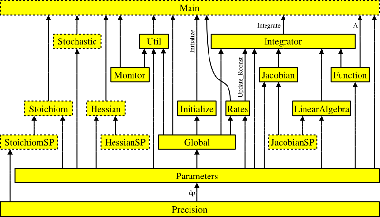
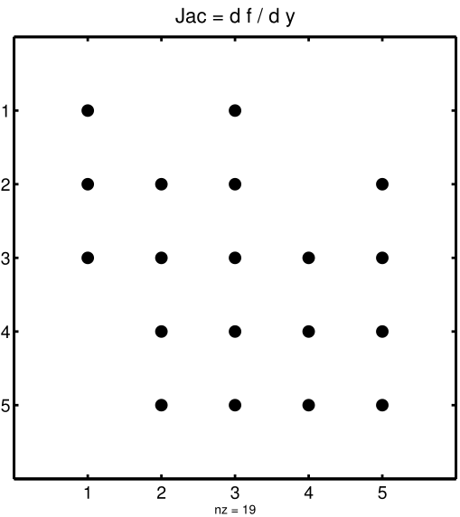
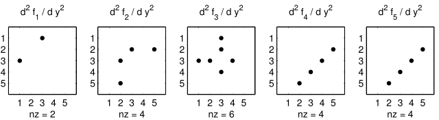

.. _output-from-kpp:

###############
Output from KPP
###############

This chapter describes the source code files that are generated by
KPP.

.. _f90-code:

==================
The Fortran90 code
==================

The code generated by KPP is organized in a set of separate files. Each
has a complete description of how it was generated at the begining of
the file. The files associated with root are named with a
corresponding prefix :code:`ROOT_`  A short description of each file
is contained in the following sections.

   Figure 1: Interdependencies of the KPP-generated files. Each arrow
   starts at the module that exports a variable or subroutine and
   points to the module that imports it via the Fortran90 :code:`USE`
   instruction.  The prefix :code:`ROOT_` has been omitted from module
   names for better readability. Dotted boxes show optional files that
   are only produced under certain circumstances.

All subroutines and functions, global parameters, variables, and
sparsity data structures are encapsulated in modules. There is exactly
one module in each file, and the name of the module is identical to the
file name but without the suffix :code:`.f90` or :code:`.F90`. `Figure 1
(above) <The Fortran90 code_>`_ shows how these modules are related to
each other. The generated code is consistent with the Fortran90
standard. It may, however, exceed the official maximum number of 39
continuation lines.

.. tip::

   The default Fortran90 file suffix is :code:`.f90`.  To have KPP
   generate Fortran90 code ending in :file:`.F90` instead, add the
   command :command:`#UPPERCASEF90 ON` to the KPP definition file.

.. _Main:

ROOT_Main
---------

:file:`ROOT_Main.f90` (or :file:`.F90`) root is the main
Fortran90 program. It contains the driver after modifications by the
substitution preprocessor. The name of the file is computed by KPP by
appending the suffix to the root name.

Using :command:`#DRIVER none` will skip generating this file.

.. _Model:

ROOT_Model
----------

The file :file:`ROOT_Model.f90` (or :file:`.F90`) unifies all model
definitions in a single module. This simplifies inclusion into
external Fortran programs.

.. _Initialize:

ROOT_Initialize
---------------

The file :file:`ROOT_Initialize.f90` (or :file:`.F9O`)
contains the subroutine :code:`Initialize`, which defines initial
values of the chemical species. The driver calls the subroutine once
before the time integration loop starts.

.. _Integrator:

ROOT_Integrator
---------------

The file :file:`ROOT_Integrator.f90` (or :file:`.F90`)
contains the subroutine :code:`Integrate`, which is called every time
step during the integration. The integrator that was chosen with the
:ref:`integrator-cmd` command is also included in this file.  In case
of an unsuccessful integration, the module root provides a short error
message  in the public variable :code:`IERR_NAME`.

.. _Monitor:

ROOT_Monitor
------------

The file :file:`ROOT_Monitor.f90` (:file:`.F90`) contains
arrays with information about the chemical mechanism. The names of all
species are included in :code:`SPC_NAMES` and the names of all
equations are included in :code:`EQN_NAMES`.

It was shown (cf. :ref:`eqntags-cmd`) that each reaction
in the section may start with an equation tag which is enclosed in
angle brackets, e.g.:

.. code-block:: console

    <R1> NO2 + hv = NO + O3P :  6.69e-1*(SUN/60.0e0);

If the equation tags are switched on, KPP also generates the
:code:`PARAMETER` array :code:`EQN_TAGS`. In combination with
:code:`EQN_NAMES` and the function :code:`tag2num` that converts the
equation tag to the KPP-internal tag number, this can be used to
describe a reaction:

.. code-block:: none

   PRINT*, ’Reaction 1 is:’, EQN_NAMES( tag2num( ’R1’ ) )

.. _Precision:

ROOT_Precision
--------------

Fortran90 code uses parameterized real
types. :file:`ROOT_Precision.f90` (or :file:`.F90`) contains the
following real kind definitions:

.. code-block:: fortran

   ! KPP_SP - Single precision kind
     INTEGER, PARAMETER :: &
       SP = SELECTED_REAL_KIND(6,30)
   ! KPP_DP - Double precision kind
     INTEGER, PARAMETER :: &
       DP = SELECTED_REAL_KIND(12,300)

Depending on the choice of the :ref:`double-cmd` command, the real
variables are of type double (:code:`REAL(kind=dp)`) or single
precision (:code:`REAL(kind=sp)`). Changing the parameters of the
:code:`SELECTED_REAL_KIND` function in this module will cause a change
in the working precision for the whole model.

.. _Rates:

ROOT_Rates
----------

The code to update the rate constants is in :file:`ROOT_Rates.f90` (or
:file:`.F90`). The user defined rate law functions (cf.
:ref:`table-rat-fun`) are also placed here.

.. _table-rat-fun:

.. table:: Fortran90 subrotutines in ROOT_Rates
   :align: center

   +-----------------------+--------------------------------------+
   | Function              | Description                          |
   +=======================+======================================+
   | :code:`Update_PHOTO`  | Update photolysis rate coefficients  |
   +-----------------------+--------------------------------------+
   | :code:`Update_RCONST` | Update all rate coefficients         |
   +-----------------------+--------------------------------------+
   | :code:`Update_SUN`    | Update sun intensity                 |
   +-----------------------+--------------------------------------+

.. _Parameters:

ROOT_Parameters
---------------

Global parameters are defined and initialized in
:file:`ROOT_Parameters.f90` (or :file:`.F90`):

.. _table-par:

.. table:: Parameters Declared in ROOT_Parameters
   :align: center

   +----------------+---------------------------------------------+---------+
   | Parameter      | Represents                                  | Example |
   +================+=============================================+=========+
   | ``NSPEC``      | No. chemical species (``NVAR`` + ``NFIX``)  | 7       |
   +----------------+---------------------------------------------+---------+
   | ``NVAR``       | No. variable species                        | 5       |
   +----------------+---------------------------------------------+---------+
   | ``NFIX``       | No. fixed species                           | 2       |
   +----------------+---------------------------------------------+---------+
   | ``NREACT``     | No. reactions                               | 10      |
   +----------------+---------------------------------------------+---------+
   | ``NONZERO``    | No. nonzero entries Jacobian                | 18      |
   +----------------+---------------------------------------------+---------+
   | ``LU_NONZERO`` | As above, after LU factorization            | 19      |
   +----------------+---------------------------------------------+---------+
   | ``NHESS``      | Length, sparse Hessian                      | 10      |
   +----------------+---------------------------------------------+---------+
   | ``NJVRP``      | Length, sparse Jacobian JVRP                | 13      |
   +----------------+---------------------------------------------+---------+
   | ``NSTOICM``    | Length, stoichiometric matrix               | 22      |
   +----------------+---------------------------------------------+---------+
   | ``ind_spc``    | Index of species *spc* in :code:`C`         |         |
   +----------------+---------------------------------------------+---------+
   | ``indf_spc``   | Index of fixed species *spc* in :code:`FIX` |         |
   +----------------+---------------------------------------------+---------+

Example values listed in the 3rd column are taken from the
:program:`small_strato` mechanism (cf.
:ref:`running-kpp-with-an-example-mechanism`).

KPP orders the variable species such that the sparsity pattern of the
Jacobian is maintained after an LU decomposition. For our example there
are five variable species (:code:`NVAR = 5`) ordered as

.. code-block:: fortran

   ind_O1D=1, ind_O=2, ind_O3=3, ind_NO=4, ind_NO2=5

and two fixed species (:code:`NFIX = 2`)

.. code-block:: fortran

   ind_M = 6, ind_O2 = 7.

KPP defines a complete set of simulation parameters, including the
numbers of variable and fixed species, the number of chemical reactions,
the number of nonzero entries in the sparse Jacobian and in the sparse
Hessian, etc.

.. _Global:

ROOT_Global
-----------

Several global variables are declared in :file:`ROOT_Global.f90` (or
:file:`.F90`):

.. _table-glob:

.. table:: Global Variables Declared in ROOT_Global
   :align: center

   +-------------------------+---------------------------------------------+
   | Global variable         | Represents                                  |
   +=========================+=============================================+
   | :code:`C(NSPEC)`        | Concentrations, all species                 |
   +-------------------------+---------------------------------------------+
   | :code:`VAR(:)`          | Concentrations, variable species (pointer)  |
   +-------------------------+---------------------------------------------+
   | :code:`FIX(:)`          | Concentrations, fixed species (pointer)     |
   +-------------------------+---------------------------------------------+
   | :code:`RCONST(NREACT)`  | Rate coefficient values                     |
   +-------------------------+---------------------------------------------+
   | :code:`TIME`            | Current integration time                    |
   +-------------------------+---------------------------------------------+
   | :code:`SUN`             | Sun intensity between 0 and 1               |
   +-------------------------+---------------------------------------------+
   | :code:`TEMP`            | Temperature                                 |
   +-------------------------+---------------------------------------------+
   | :code:`TSTART, TEND`    | Simulation start/end time                   |
   +-------------------------+---------------------------------------------+
   | :code:`DT`              | Simulation time step                        |
   +-------------------------+---------------------------------------------+
   | :code:`ATOL(NSPEC)`     | Absolute tolerances                         |
   +-------------------------+---------------------------------------------+
   | :code:`RTOL(NSPEC)`     | Relative tolerances                         |
   +-------------------------+---------------------------------------------+
   | :code:`STEPMIN`         | Lower bound for time step                   |
   +-------------------------+---------------------------------------------+
   | :code:`STEPMAX`         | Upper bound for time step                   |
   +-------------------------+---------------------------------------------+
   | :code:`CFACTOR`         | Conversion factor                           |
   +-------------------------+---------------------------------------------+

Both variable and fixed species are stored in the one-dimensional
array :code:`C`. The first part (indices from :code:`1` to :code:`NVAR`)
contains the variable species, and the second part (indices from to
:code:`NVAR+1` to :code:`NSPEC`) the fixed species. The total number
of species is the sum of the :code:`NVAR` and :code:`NFIX`. The parts
can also be accessed separately through pointer variables :code:`VAR` and
:code:`FIX`, which point to the proper elements in :code:`C`.

.. code-block:: fortran

   VAR(1:NVAR) => C(1:NVAR)
   FIX(1:NFIX) => C(NVAR+1:NSPEC)

.. important::

   In previous versions of KPP, Fortran90 code was generated with
   :code:`VAR` and :code:`FIX` being linked to the :code:`C` array
   with an :code:`EQUIVALENCE` statement.  This construction, however,
   is not thread-safe, and it prevents KPP-generated Fortran90 code
   from being used within parallel environments (e.g. such as an
   `OpenMP <https://openmp.org>`_ parallel loop).

   We have modified :ref:`kpp250` and later versions to make KPP-generated
   Fortran90 code thread-safe.  :code:`VAR` and
   :code:`FIX` are now :code:`POINTER` variables that
   point to the proper slices of the :code:`C` array.  They are also
   nullified when no longer needed.  :code:`VAR` and :code:`FIX` are
   now also kept internal to the various integrator files located in
   the :file:`$KPP_HOME/int` directory.

.. _Function:

ROOT_Function
-------------

The chemical ODE system for our :program:`small_strato` example
(described in :ref:`running-kpp-with-an-example-mechanism`) is:

.. math::

   \begin{aligned}
   \frac{d[O(^1D)]}{dt} & = & k_{5}\, [O_3] - k_{6}\, [O(^1D)]\, [M] - k_{7}\, [O(^1D)]\, [O_3]\\
   \frac{d[O]}{dt} & = & 2\, k_{1}\, [O_2] - k_{2}\, [O]\, [O_2] + k_{3}\, [O_3]\\
   & & - k_{4}\, [O]\, [O_3]+ k_{6}\, [O(^1D)]\, [M]\\
   & & - k_{9}\, [O]\, [NO_2] + k_{10}\, [NO_2]\\
   \frac{d[O_3]}{dt} & = & k_{2}\, [O]\, [O_2] - k_{3}\,
   [O_3] - k_{4}\, [O]\, [O_3] - k_{5}\, [O_3]\\
   & & - k_{7}\, [O(^1D)]\, [O_3] - k_{8}\, [O_3]\, [NO]\\
   \frac{d[NO]}{dt} & = & - k_{8}\, [O_3]\, [NO] + k_{9}\, [O]\, [NO_2] + k_{10}\, [NO_2]\\
   \frac{d[NO_2]}{dt} & = & k_{8}\, [O_3]\, [NO] - k_{9}\, [O]\, [NO_2] - k_{10}\, [NO_2]\\
   \end{aligned}

where square brackets denote concentrations of the species. The code for
the ODE function is in :code:`ROOT_Function.f90` (or :code:`.F90`) The
chemical reaction mechanism represents a set of ordinary differential
equations (ODEs) of dimension . The concentrations of fixed species
are parameters in the derivative function. The subroutine computes
first the vector :code:`A` of reaction rates and then the vector
:code:`Vdot` of variable species time derivatives. The input arguments
:code:`V`, :code:`F`, :code:`RCT` are the concentrations of variable
species, fixed species, and the rate coefficients,
respectively. :code:`A` and :code:`Vdot` may be returned to the
calling program (for diagnostic purposes) with optional ouptut
argument :code:`Aout`. Below is the Fortran90
code generated by KPP for the ODE function of our
:program:`small_strato` example.

.. code-block:: fortran

   SUBROUTINE Fun (V, F, RCT, Vdot, Aout, Vdotout )

   ! V - Concentrations of variable species (local)
     REAL(kind=dp) :: V(NVAR)
   ! F - Concentrations of fixed species (local)
     REAL(kind=dp) :: F(NVAR)
   ! RCT - Rate constants (local)
     REAL(kind=dp) :: RCT(NREACT)
   ! Vdot - Time derivative of variable species concentrations
     REAL(kind=dp) :: Vdot(NVAR)
   ! Aout - Optional argument to return equation rate constants
     REAL(kind=dp), OPTIONAL :: Aout(NREACT)

   ! Computation of equation rates
     A(1) = RCT(1)*F(2)
     A(2) = RCT(2)*V(2)*F(2)
     A(3) = RCT(3)*V(3)
     A(4) = RCT(4)*V(2)*V(3)
     A(5) = RCT(5)*V(3)
     A(6) = RCT(6)*V(1)*F(1)
     A(7) = RCT(7)*V(1)*V(3)
     A(8) = RCT(8)*V(3)*V(4)
     A(9) = RCT(9)*V(2)*V(5)
     A(10) = RCT(10)*V(5)

     !### Use Aout to return equation rates
     IF ( PRESENT( Aout ) ) Aout = A

   ! Aggregate function
     Vdot(1) = A(5)-A(6)-A(7)
     Vdot(2) = 2*A(1)-A(2)+A(3) &
               -A(4)+A(6)-A(9)+A(10)
     Vdot(3) = A(2)-A(3)-A(4)-A(5) &
               -A(7)-A(8)
     Vdot(4) = -A(8)+A(9)+A(10)
     Vdot(5) = A(8)-A(9)-A(10)

   END SUBROUTINE Fun

.. _Jacobian-and-JacobianSP:

ROOT_Jacobian and ROOT_JacobianSP
---------------------------------

The Jacobian matrix for our example contains 18 non-zero elements:

.. math::

   \begin{aligned}
     \mathbf{J}(1,1) & = & - k_{6}\, [{M}] - k_{7}\, [{O_3}]\\
     \mathbf{J}(1,3) & = & k_{5} - k_{7}\, [{O(^1D)}]\\
     \mathbf{J}(2,1) & = & k_{6}\, [{M}]\\
     \mathbf{J}(2,2) & = & - k_{2}\, [{O_2}] - k_{4}\, [{O_3}]
                           - k_{9}\, [{NO_2}]\\
     \mathbf{J}(2,3) & = & k_{3} - k_{4}\, [{O}]\\
     \mathbf{J}(2,5) & = & - k_{9}\, [{O}] + k_{10}\\
     \mathbf{J}(3,1) & = & - k_{7}\, [{O_3}]\\
     \mathbf{J}(3,2) & = & k_{2}\, [{O_2}] - k_{4}\, [{O_3}]\\
     \mathbf{J}(3,3) & = & - k_{3} - k_{4}\, [{O}] - k_{5} - k_{7}\,
                           [{O(^1D)}] - k_{8}\, [{NO}]\\
     \mathbf{J}(3,4) & = & - k_{8}\, [{O_3}]\\
     \mathbf{J}(4,2) & = & k_{9}\, [{NO_2}]\\
     \mathbf{J}(4,3) & = & - k_{8}\, [{NO}]\\
     \mathbf{J}(4,4) & = & - k_{8}\, [{O_3}]\\
     \mathbf{J}(4,5) & = & k_{9}\, [{O}] + k_{10}\\
     \mathbf{J}(5,2) & = & - k_{9}\, [{NO_2}]\\
     \mathbf{J}(5,3) & = & k_{8}\, [{NO}]\\
     \mathbf{J}(5,4) & = & k_{8}\, [{O_3}]\\
     \mathbf{J}(5,5) & = & - k_{9}\, [{O}] - k_{10}\\
   \end{aligned}

It defines how the temporal change of each chemical species depends on
all other species. For example, :math:`\mathbf{J}(5,2)` shows that :math:`NO_2`
(species number 5) is affected by :math:`O` (species number 2) via
reaction R9. The sparse data structures for the Jacobian are
declared and initialized in :file:`ROOT_JacobianSP.f90` (or
:file:`.F90`). The code for the ODE Jacobian and
sparse multiplications is in :file:`ROOT_Jacobian.f90` (or
:file:`.F90`).

.. tip::

   Adding either :command:`#JACOBIAN SPARSE_ROW` or
   :command:`#JACOBIAN SPARSE_LU_ROW` to the KPP definition file will
   create the file :file:`ROOT_JacobianSP.f90` (or :file:`.F90`).

The Jacobian of the ODE function is automatically constructed by KPP.
KPP generates the Jacobian subroutine :code:`Jac` or :code:`JacSP` where
the latter is generated when the sparse format is required. Using the
variable species :code:`V`, the fixed species :code:`F`, and the rate
coefficients :code:`RCT` as input, the subroutine calculates the
Jacobian :code:`JVS`. The default data structures for the sparse
compressed on rows Jacobian representation (for the case where the LU
fill-in is accounted for) are:

.. _table-jac:

.. table:: Sparse Jacobian Data Structures
   :align: center

   +------------------------------+-------------------------------------+
   | Global variable              | Represents                          |
   +==============================+=====================================+
   | :code:`JVS(LU_NONZERO)`      | Jacobian nonzero elements           |
   +------------------------------+-------------------------------------+
   | :code:`LU_IROW(LU_NONZERO)`  | Row indices                         |
   +------------------------------+-------------------------------------+
   | :code:`LU_ICOL(LU_NONZERO)`  | Column indices                      |
   +------------------------------+-------------------------------------+
   | :code:`LU_CROW(NVAR+1)`      | Start of rows                       |
   +------------------------------+-------------------------------------+
   | :code:`LU_DIAG(NVAR+1)`      | Diagonal entries                    |
   +------------------------------+-------------------------------------+

:code:`JVS` stores the :code:`LU_NONZERO` elements of the
Jacobian in row order. Each row :code:`I` starts at position
:code:`LU_CROW(I)`, and :code:`LU_CROW(NVAR+1)` =
:code:`LU_NONZERO+1`. The location of the :code:`I`-th diagonal
element is :code:`LU_DIAG(I)`. The sparse element :code:`JVS(K)` is
the Jacobian entry in row :code:`LU_IROW(K)` and column
:code:`LU_ICOL(K`). For the :program:`small_strato` example KPP
generates the following Jacobian sparse data structure:

.. code-block:: fortran

   LU_ICOL = (/ 1,3,1,2,3,5,1,2,3,4, &
               5,2,3,4,5,2,3,4,5 /)
   LU_IROW = (/ 1,1,2,2,2,2,3,3,3,3, &
               3,4,4,4,4,5,5,5,5 /)
   LU_CROW = (/ 1,3,7,12,16,20 /)
   LU_DIAG = (/ 1,4,9,14,19,20 /)

This is visualized in Figure 2 below.. The sparsity coordinate
vectors are computed by KPP and initialized statically. These vectors
are constant as the sparsity pattern of the Jacobian does not change
during the computation.

.. _figure-2:

	 small_strato example.
   :scale: 60%
   :align: center

   Figure 2: The sparsity pattern of the Jacobian for the
   :program:`small_strato` example. All non-zero elements are marked
   with a bullet. Note that even though :math:`\mathbf{J}(3,5)` is
   zero, it is also included here because of the fill-in.

Two other KPP-generated routines, :code:`Jac_SP_Vec` and
:code:`JacTR_SP_Vec` (see :ref:`table-jac-fun`) are useful for direct
and adjoint sensitivity analysis. They perform sparse multiplication of
:code:`JVS` (or its transpose for :code:`JacTR_SP_Vec`) with the
user-supplied vector :code:`UV` without any indirect addressing.

.. _table-jac-fun:

.. table:: Fortran90 subroutines in ROOT_Jacobian
   :align: center

   +----------------------+----------------------------------------------+
   | Function             | Description                                  |
   +======================+==============================================+
   | :code:`Jac_SP`       | ODE Jacobian in sparse format                |
   +----------------------+----------------------------------------------+
   | :code:`Jac_SP_Vec`   | Sparse multiplication                        |
   +----------------------+----------------------------------------------+
   | :code:`JacTR_SP_Vec` | Sparse multiplication                        |
   +----------------------+----------------------------------------------+
   | :code:`Jac`          | ODE Jacobian in full format                  |
   +----------------------+----------------------------------------------+

.. _Hessian-and-HessianSP:

ROOT_Hessian and ROOT_HessianSP
-------------------------------

The sparse data structures for the Hessian are declared and initialized
in :file:`ROOT_Hessian.f90` (or :file:`.F90`). The Hessian
function and associated sparse multiplications are in
:code:`ROOT_HessianSP.f90` (or :code:`.F90`).

The Hessian contains the second order derivatives of the time derivative
functions. More exactly, the Hessian is a 3-tensor such that

.. math::

   H_{i,j,k} = \frac{\partial^2 ({\mathrm{d}}c/{\mathrm{d}}t)_i}{\partial c_j \,\partial c_k}~,
     \qquad 1 \le i,j,k \le N_{\rm var}~.
   \label{eqn:Hessian1}

KPP generates the routine :code:`Hessian`:

.. _table-hess-fun:

.. table:: Fortran90 functions in ROOT_Hessian
   :align: center

   +--------------------+--------------------------------------+
   | Function           | Description                          |
   +====================+======================================+
   | :code:`Hessian`    | ODE Hessian in sparse format         |
   +--------------------+--------------------------------------+
   | :code:`Hess_Vec`   | Hessian action on vectors            |
   +--------------------+--------------------------------------+
   | :code:`HessTR_Vec` | Transposed Hessian action on vectors |
   +--------------------+--------------------------------------+

Using the variable species :code:`V`, the fixed species :code:`F`, and
the rate coefficients :code:`RCT` as input, the subroutine
:code:`Hessian` calculates the Hessian. The Hessian is a very sparse
tensor.  The sparsity of the Hessian for our example is visualized in
:ref:`figure-3`

.. _figure-3:

   Figure 3: The Hessian of the small_strato example.

KPP computes the number of nonzero Hessian entries and saves it in the
variable :code:`NHESS`. The Hessian itself is represented in
coordinate sparse format. The real vector :code:`HESS` holds the values, and the
integer vectors :code:`IHESS_I`, :code:`IHESS_J`, and :code:`IHESS_K`
hold the indices of nonzero entries as illustrated in :ref:`table-hess`.

.. _table-hess:

.. table:: Sparse Hessian Data
   :align: center

   +-------------------------+----------------------------------------------+
   | Variable                | Represents                                   |
   +=========================+==============================================+
   | :code:`HESS(NHESS)`     | Hessian nonzero elements :math:`H_{i,j,k}`   |
   +-------------------------+----------------------------------------------+
   | :code:`IHESS_I(NHESS)`  | Index :math:`i` of element :math:`H_{i,j,k}` |
   +-------------------------+----------------------------------------------+
   | :code:`IHESS_J(NHESS)`  | Index :math:`j` of element :math:`H_{i,j,k}` |
   +-------------------------+----------------------------------------------+
   | :code:`IHESS_J(NHESS)`  | Index :math:`k` of element :math:`H_{i,j,k}` |
   +-------------------------+----------------------------------------------+

Since the time derivative function is smooth, these Hessian matrices
are symmetric, :math:`\tt HESS_{i,j,k}`\ =\ :math:`\tt HESS_{i,k,j}`.
KPP stores only  those entries :math:`\tt HESS_{i,j,k}` with
:math:`j \le k`. The sparsity coordinate vectors :code:`IHESS_1`,
:code:`IHESS_J` and :code:`IHESS_K` are computed by KPP and
initialized statically. They are constant as the sparsity pattern of
the Hessian does not change during the computation.

The routines :code:`Hess_Vec` and :code:`HessTR_Vec` compute the
action of the Hessian (or its transpose) on a pair of user-supplied
vectors :code:`U1` and :code:`U2`. Sparse operations are employed to
produce the result vector.

.. _LinearAlgebra:

ROOT_LinearAlgebra
------------------

Sparse linear algebra routines are in the file
:file:`ROOT_LinearAlgebra.f90` (or :file:`.F90`). To
numerically solve for the chemical concentrations one must employ an
implicit timestepping technique, as the system is usually stiff. Implicit
integrators solve systems of the form

.. math:: P\, x = (I - h \gamma J)\, x = b

where the matrix :math:`P=I - h \gamma J` is refered to as the
“prediction matrix”. :math:`I` the identity matrix, :math:`h` the
integration time step, :math:`\gamma` a scalar parameter depending on
the method, and :math:`J` the system Jacobian. The vector :math:`b` is
the system right hand side and the solution :math:`x` typically
represents an increment to update the solution.

The chemical Jacobians are typically sparse, i.e. only a relatively
small number of entries are nonzero. The sparsity structure of :math:`P`
is given by the sparsity structure of the Jacobian, and is produced by
KPP (with account for the fill-in) as discussed above.

KPP generates the sparse linear algebra subroutine :code:`KppDecomp`
(see :ref:`table-la-fun`) which performs an in-place, non-pivoting,
sparse LU decomposition of the prediction matrix :math:`P`. Since the
sparsity structure accounts for fill-in, all elements of the full LU
decomposition are actually stored. The output argument :code:`IER`
returns a value that is nonzero if singularity is detected.

.. _table-la-fun:

.. table:: Fortran90 functions in ROOT_LinearAlgebra
   :align: center

   +--------------------+--------------------------------------+
   | Function           | Description                          |
   +====================+======================================+
   | :code:`KppDecomp`  | Sparse LU decomposition              |
   +--------------------+--------------------------------------+
   | :code:`KppSolve`   | Sparse back subsitution              |
   +--------------------+--------------------------------------+
   | :code:`KppSolveTR` | Transposed sparse back substitution  |
   +--------------------+--------------------------------------+

The subroutines :code:`KppSolve` and :code:`KppSolveTr` and use the
in-place LU factorization :math:`P` as computed by and perform sparse
backward and forward substitutions (using :math:`P` or its
transpose). The sparse linear algebra routines :code:`KppDecomp` and
:code:`KppSolve` are extremely efficient, as shown by
:cite:t:`Sandu_et_al._1996`.

.. _Stoichiom-and-StoichiomSP:

ROOT_Stoichiom and ROOT_StoichiomSP
-----------------------------------

These files contain contain a description of the chemical mechanism in
stoichiometric form. The file  :file:`ROOT_Stoichiom.f90` (or
:file:`.F90`) contains the functions for reactant
products and its Jacobian, and derivatives with respect to rate
coefficients. The declaration and initialization of the stoichiometric
matrix and the associated sparse data structures is done in
:file:`ROOT_StochiomSP.f90` (or :file:`.F90`).

.. tip::

   Adding :command:`#STOICMAT ON` to the KPP definition file will
   create the file :file:`ROOT_Stoichiom.f90` (or :file:`.F90`)
   Also, if either :command:`#JACOBIAN SPARSE ROW` or
   :command:`#JACOBIAN SPARSE_LU_ROW` are also added to the KPP
   definition file, the file :file:`ROOT_StoichiomSP.f90` (or
   :file:`.F90`) will also be created.

The stoichiometric matrix is constant sparse. For our example the matrix
:code:`NSTOICM=22` has 22 nonzero entries out of 50 entries. KPP produces the
stoichiometric matrix in sparse, column-compressed format, as shown in
:ref:`table-sto`. Elements are stored in columnwise order in the
one-dimensional vector of values :code:`STOICM`. Their row and column indices
are stored in :code:`ICOL_STOICM` and :code:`ICOL_STOICM`
respectively. The vector :code:`CCOL_STOICM` contains pointers to
the start of each column. For example column :code:`j` starts in the sparse
vector at position :code:`CCOL_STOICM(j)` and ends at
:code:`CCOL_STOICM(j+1)-1`. The last value :code:`CCOL_STOICM(NVAR)` =
:code:`NSTOICHM+1` simplifies the handling of sparse data structures.

.. _table-sto:

.. table:: Sparse Stoichiometric Matrix
   :align: center

   +-------------------------------+-----------------------------------------+
   | Variable                      | Represents                              |
   +===============================+=========================================+
   | :code:`STOICM(NSTOICM)`       | Stoichiometric matrix                   |
   +-------------------------------+-----------------------------------------+
   | :code:`IROW_STOICM(NSTOICM)`  | Row indices                             |
   +-------------------------------+-----------------------------------------+
   | :code:`ICOL_STOICM(NSTOICM)`  | Column indices                          |
   +-------------------------------+-----------------------------------------+
   | :code:`CCOL_STOICM(NREACT+1)` | Start of columns                        |
   +-------------------------------+-----------------------------------------+

.. _table-sto-fun:

.. table:: Fortran90 functions in ROOT_Stoichiom
   :align: center

   +-------------------------+--------------------------------------------+
   | Variable                | Represents                                 |
   +=========================+============================================+
   | :code:`dFun_dRcoeff`    | Derivatives of Fun w/r/t rate coefficients |
   +-------------------------+--------------------------------------------+
   | :code:`dJac_dRcoeff`    | Derivatives of Jac w/r/t rate coefficients |
   +-------------------------+--------------------------------------------+
   | :code:`ReactantProd`    | Reactant products                          |
   +-------------------------+--------------------------------------------+
   | :code:`JacReactantProd` | Jacobian of reactant products              |
   +-------------------------+--------------------------------------------+

The subroutine :code:`ReactantProd` (see :ref:`table-sto-fun`)
computes the reactant products :code:`ARP` for each reaction, and the
subroutine :code:`JacReactantProd`  computes the Jacobian of reactant products
vector, i.e.:

.. math::

   \begin{aligned}
   \tt JVRP = {\partial{\tt ARP}}/{\partial{\tt V}}
   \end{aligned}

The matrix :code:`JVRP` is sparse and is computed and stored in row
compressed sparse format, as shown in :ref:`table-hess-fun`. The
parameter :code:`NJVRP` holds the number of nonzero elements. For our
:program:`small_strato` example:

.. code-block:: fortran

   NJVRP = 13
   CROW_JVRP = (/ 1,1,2,3,5,6,7,9,11,13,14 /)
   ICOL_JVRP = (/ 2,3,2,3,3,1,1,3,3,4,2,5,4 /)

.. _table-jvrp:

.. table:: Sparse Data for Jacobian of Reactant Products
   :align: center

   +-------------------------------+-----------------------------------------+
   | Variable                      | Represents                              |
   +===============================+=========================================+
   | :code:`JVRP(NJVRP)`           | Nonzero elements of :code:`JVRP`        |
   +-------------------------------+-----------------------------------------+
   | :code:`ICOL_JVRP(NJVRP)`      | Column indices of :code:`JVRP`          |
   +-------------------------------+-----------------------------------------+
   | :code:`IROW_JVRP(NJVRP)`      | Row indices of :code:`JVRP`             |
   +-------------------------------+-----------------------------------------+
   | :code:`CROW_JVRP(NREACT+1)`   | Start of rows in :code:`JVRP`           |
   +-------------------------------+-----------------------------------------+

If :command:`#STOICMAT` is set to :command:`ON`, the stoichiometric
formulation allows a direct computation of the derivatives with
respect to rate coefficients.

The subroutine :code:`dFun_dRcoeff` computes the partial derivative
:code:`DFDR` of the ODE function with respect to a subset of
:code:`NCOEFF` reaction coefficients, whose indices are specified in the array

.. math::

   \begin{aligned}
   \tt DFDR = {\partial{\tt Vdot}}/{\partial{\tt RCT(JCOEFF)}}
   \end{aligned}

Similarly one can obtain the partial derivative of the Jacobian with
respect to a subset of the rate coefficients. More exactly, KPP
generates the subroutine :code:`dJacR_dCoeff`, which calculates
:code:`DJDR`, the product of this partial derivative with a
user-supplied vector :code:`U`:

.. math::

   \begin{aligned}
   \tt DJDR = [{\partial{\tt JVS}}/{\partial{\tt RCT(JCOEFF)}}]
   \times {\tt U}
   \end{aligned}

.. _Stochastic:

ROOT_Stochastic
---------------

If the generation of stochastic functions is switched on (i.e. when
the command :command:`#STOCHASTIC ON` is added to the KPP definition
file), KPP produces the file :code:`ROOT_Stochastic.f90` (or :code:`.F90`),
with the following functions:

:code:`Propensity` calculates the propensity vector. The propensity
function uses the number of molecules of variable (:code:`Nmlcv`) and
fixed (:code:`Nmlcf`) species, as well as the stochastic rate
coefficients (:code:`SCT`) to calculate the vector of propensity rates
(:code:`Propensity`). The propensity :math:`\tt Prop_j` defines the
probability that the next reaction in the system is the :math:`j^{th}`
reaction.

:code:`StochasticRates` converts deterministic rates to
stochastic. The stochastic rate coefficients (:code:`SCT`) are
obtained through a scaling of the deterministic rate
coefficients (:code:`RCT`). The scaling depends on the :code:`Volume`
of the reaction container and on the number of molecules which react.

:code:`MoleculeChange` calculates changes in the number of
molecules. When the reaction with index :code:`IRCT` takes place, the
number of molecules of species involved in that reaction changes. The
total number of molecules is updated by the function.

These functions are used by the Gillespie numerical integrators (direct
stochastic simulation algorithm). These integrators are provided in both
Fortran90 and C implementations (the template file name is
:file:`gillespie`). Drivers for stochastic simulations are also
implemented (the template file name is :code:`general_stochastic`.).

.. _Util:

ROOT_Util
---------

In addition to the chemical system description routines discussed above,
KPP generates several utility subroutines and functions in the file
:file:`ROOT_Util.f90` (or :file:`.F90`).

.. _table-util-fun:

.. table:: Fortran90 subroutines and functions in ROOT_Util
   :align: center

   +-----------------------------------+---------------------------------------------+
   | Function                          | Description                                 |
   +===================================+=============================================+
   | :code:`GetMass`                   | Check mass balance for selected atoms       |
   +-----------------------------------+---------------------------------------------+
   | :code:`Shuffle_kpp2user`          | Shuffle concentration vector                |
   +-----------------------------------+---------------------------------------------+
   | :code:`Shuffle_user2kpp`          | Shuffle concentration vector                |
   +-----------------------------------+---------------------------------------------+
   | :code:`InitSaveData`              | Utility for :command:`#LOOKAT` command      |
   +-----------------------------------+---------------------------------------------+
   | :code:`SaveData`                  | Utility for :command:`#LOOKAT` command      |
   +-----------------------------------+---------------------------------------------+
   | :code:`CloseSaveData`             | Utility for :command:`#LOOKAT` command      |
   +-----------------------------------+---------------------------------------------+
   | :code:`tag2num`                   | Calculate reaction number from equation tag |
   +-----------------------------------+---------------------------------------------+
   | :code:`Integrator_Update_Options` | Choose :code:`Update_RCONST/PHOTO/SUN`      |
   +-----------------------------------+---------------------------------------------+
           
The subroutines :code:`InitSaveData`, :code:`SaveData`, and
:code:`CloseSaveData` can be used to print the concentration of the
species that were selected with :command:`#LOOKAT` to the file
:file:`ROOT.dat` (cf. :ref:`lookat-and-monitor`).

.. _Mex-code:

ROOT_mex_Fun, ROOT_mex_Jac_SP, and ROOT_mex_Hessian
---------------------------------------------------

:program:`Mex` is a Matlab extension. KPP generates the mex
routines for the ODE function, Jacobian, and Hessian, for the target
languages C, Fortran77, and Fortran90.

.. tip::

   To generate Mex files, add the command :command:`#MEX ON` to the KPP
   definition file.

After compilation (using
Matlab’s mex compiler) the mex functions can be called instead of the
corresponding Matlab m-functions. Since the calling syntaxes are
identical, the user only has to insert the :program:`mex` string
within the corresponding function name. Replacing m-functions by
mex-functions gives the same numerical results, but the computational
time could be considerably smaller, especially for large kinetic
systems.

If possible we recommend to build mex files using the C language, as
Matlab offers most mex interface options for the C language. Moreover,
Matlab distributions come with a native C compiler (:program:`lcc`) for
building executable functions from mex files. The mex files built using
Fortran90 may require further platform-specific tuning of the mex
compiler options.

.. _C-code:

==========
The C code
==========

.. important::

   Some run-time options for C-language integrators (specified in
   the :ref:`ICNTRL and RCNTRL arrays <icntrl-rcntrl>`) do not exactly
   correspond to the Fortran90 run-time options.  We will standardize
   run-time integrator options across all target languages in a future
   KPP release.

The driver file :file:`ROOT.c` contains the main (driver) program and
numerical integrator functions, as well as declarations and
initializations of global variables.
   
The generated C code includes three header files which are
:code:`#include`-d in other files as appropriate.

#. The global parameters (cf. :ref:`table-par`) are :code:`#include`-d in
   the header file :file:`ROOT_Parameters.h`

#. The global variables (cf. :ref:`table-glob`) are extern-declared in
   :file:`ROOT_Global.h` and declared in the driver file :file:`ROOT.c`.

#. The header file :file:`ROOT_Sparse.h` contains extern declarations
   of sparse data structures for the Jacobian (cf.
   :ref:`table-jac`),Hessian (cf. :ref:`table-hess`) and stoichiometric
   matrix (cf. :ref:`table-sto`), and the Jacobian of reaction
   products (cf. :ref:`table-jvrp`). The actual declarations of each
   datastructures is done in the corresponding files.

The code for the ODE function (see section :ref:`Function`) is in
:file:`ROOT_Function.c`.  The code for the ODE Jacobian and sparse
multiplications (cf. :ref:`Jacobian-and-JacobianSP`) is in
:file:`ROOT_Jacobian.c`, and the declaration and initialization of the
Jacobian sparse data structures is in the file
:file:`ROOT_JacobianSP.c`.  Similarly, the Hessian function and
associated sparse multiplications  (cf. :ref:`Hessian-and-HessianSP`)
are in :file:`ROOT_Hessian.c`, and the declaration and initialization
of Hessian sparse data structures are in :file:`ROOT_HessianSP.c`.

The file :file:`ROOT_Stoichiom.c` contains the functions for reactant
products and its Jacobian, and derivatives with respect to rate coefficients
(cf. :ref:`Stoichiom-and-StoichiomSP`) . The declaration and
initialization of the stoichiometric matrix and the associated sparse
data structures (cf. :ref:`table-sto`) is done in :file:`ROOT_StoichiomSP.c`.

Sparse linear algebra routines (cf. :ref:`LinearAlgebra`) are
in the file :file:`ROOT_LinearAlgebra.c`.  The code to update the rate
constants and user defined code for rate laws is in :file:`ROOT_Rates.c`.

Various utility and input/output functions (cf. :ref:`Util`) are in
:file:`ROOT_Util.c` and :file:`ROOT_Monitor.c`.

Finally, mex gateway routines that allow the C implementation of the ODE
function, Jacobian, and Hessian to be called directly from Matlab
(cf. :ref:`Mex-code`) are also generated (in the files
:file:`ROOT_mex_Fun.c`, :file:`ROOT_mex_Jac_SP.c`, and
:file:`ROOT_mex_Hessian.c`).

.. _matlab-code:

===============
The Matlab code
===============

.. important::

   Some run-time options for Matlab-language integrators (specified in
   the :ref:`ICNTRL and RCNTRL arrays <icntrl-rcntrl>`) do not exactly
   correspond to the Fortran90 run-time options.  We will standardize
   run-time integrator options across all target languages in a future
   KPP release.

`Matlab <http://www.mathworks.com/products/matlab/>`_ provides a
high-level programming environment that allows algorithm development,
numerical computations, and data analysis and visualization. The
KPP-generated Matlab code allows for a rapid prototyping of chemical
kinetic schemes, and for a convenient analysis and visualization of the
results. Differences between different kinetic mechanisms can be easily
understood. The Matlab code can be used to derive reference numerical
solutions, which are then compared against the results obtained with
user-supplied numerical techniques. KPP/Matlab can also be used to teach
students fundamentals of chemical kinetics and chemical numerical
simulations.

Each Matlab function has to reside in a separate m-file. Function calls
use the m-function-file names to reference the function. Consequently,
KPP generates one m-function-file for each of the functions discussed in
the sections entitled :ref:`Function` ,
:ref:`Jacobian-and-JacobianSP`, :ref:`Hessian-and-HessianSP`,
:ref:`Stoichiom-and-StoichiomSP`, :ref:`Util`.  The names of the
m-function-files are the same as the names of the functions (prefixed
by the model name :code:`ROOT`.

The variables of :ref:`table-par` are defined as Matlab :code:`global`
variables and initialized in the file
:file:`ROOT_parameter_defs.m`. The variables of :ref:`table-glob` are
declared as Matlab :code:`global` variables in the file
:file:`ROOT_global_defs.m`. They can be accessed from within each
Matlab function  by using declarations of the variables of interest.

The sparse data structures for the Jacobian (cf. :ref:`table-jac`), the Hessian
(cf. :ref:`table-hess`), the stoichiometric matrix (cf. :ref:`table-sto`),
and the Jacobian of reaction (see :ref:`table-jvrp`) are declared as
Matlab :code:`global` variables in the file
:file:`ROOT_Sparse_defs.m`.  They are initialized in separate m-files,
namely :file:`ROOT_JacobianSP.m`, :file:`ROOT_HessianSP.m`, and
:file:`ROOT_StoichiomSP.m` respectively.

Two wrappers (:file:`ROOT_Fun_Chem.m` and :file:`ROOT_Jac_SP_Chem.m`) are
provided for interfacing the ODE function and the sparse ODE Jacobian
with Matlab’s suite of ODE integrators. Specifically, the syntax of
the wrapper calls matches the syntax required by Matlab’s integrators
like ode15s. Moreover, the Jacobian wrapper converts the sparse KPP
format into a Matlab sparse matrix.

.. _table-matlab:

.. table:: List of Matlab model files
   :align: center

   +----------------------------------+-------------------------------------+
   | Function                         | Description                         |
   +==================================+=====================================+
   | :file:`ROOT.m`                   | Driver                              |
   +----------------------------------+-------------------------------------+
   | :file:`ROOT_parameter_defs.m`    | Global parameters                   |
   +----------------------------------+-------------------------------------+
   | :file:`ROOT_global_defs.m`       | Global variables                    |
   +----------------------------------+-------------------------------------+
   | :file:`ROOT_sparse_defs.m`       | Global sparsity data                |
   +----------------------------------+-------------------------------------+
   | :file:`ROOT_Fun_Chem.m`          | Template for ODE function           |
   +----------------------------------+-------------------------------------+
   | :file:`ROOT_Fun.m`               | ODE function                        |
   +----------------------------------+-------------------------------------+
   | :file:`ROOT_Jac_Chem.m`          | Template for ODE Jacobian           |
   +----------------------------------+-------------------------------------+
   | :file:`ROOT_Jac_SP.m`            | Jacobian in sparse format           |
   +----------------------------------+-------------------------------------+
   | :file:`ROOT_JacobianSP.m`        | Sparsity data structures            |
   +----------------------------------+-------------------------------------+
   | :file:`ROOT_Hessian.m`           | ODE Hessian in sparse format        |
   +----------------------------------+-------------------------------------+
   | :file:`ROOT_HessianSP.m`         | Sparsity data structures            |
   +----------------------------------+-------------------------------------+
   | :file:`ROOT_Hess_Vec.m`          | Hessian action on vectors           |
   +----------------------------------+-------------------------------------+
   | :file:`ROOT_HessTR_Vec.m`        | Transposed Hessian action on        |
   |                                  | vectors                             |
   +----------------------------------+-------------------------------------+
   | :file:`ROOT_stoichiom.m`         | Derivatives of Fun and Jac w/r/t    |
   |                                  | rate coefficients                   |
   +----------------------------------+-------------------------------------+
   | :file:`ROOT_stochiomSP.m`        | Sparse data                         |
   +----------------------------------+-------------------------------------+
   | :file:`ROOT_ReactantProd.m`      | Reactant products                   |
   +----------------------------------+-------------------------------------+
   | :file:`ROOT_JacReactantProd.m`   | Jacobian of reactant products       |
   +----------------------------------+-------------------------------------+
   | :file:`ROOT_Rates.m`             | User-defined rate reaction laws     |
   +----------------------------------+-------------------------------------+
   | :file:`ROOT_Update_PHOTO.m`      | Update photolysis rate coefficients |
   +----------------------------------+-------------------------------------+
   | :file:`ROOT_Update_RCONST.m`     | Update all rate coefficients        |
   +----------------------------------+-------------------------------------+
   | :file:`ROOT_Update_SUN.m`        | Update sola intensity               |
   +----------------------------------+-------------------------------------+
   | :file:`ROOT_GetMass.m`           | Check mass balance for selected     |
   |                                  | atoms                               |
   +----------------------------------+-------------------------------------+
   | :file:`ROOT_Initialize.m`        | Set initial values                  |
   +----------------------------------+-------------------------------------+
   | :file:`ROOT_Shuffle_kpp2user.m`  | Shuffle concentration vector        |
   +----------------------------------+-------------------------------------+
   | :file:`ROOT_Shuffle_user2kpp.m`  | Shuffle concentration vector        |
   +----------------------------------+-------------------------------------+

.. _Makefile:

============
The Makefile
============

KPP produces a Makefile that allows for an easy compilation of all
KPP-generated source files. The file name is :file:`Makefile_ROOT`. The
Makefile assumes that the selected driver contains the main program.
However, if no driver was selected (i.e. :command:`#DRIVER none`), it is
necessary to add the name of the main program file manually to the
Makefile.

.. _Log:

============
The log file
============

The log file :file:`ROOT.log` contains a summary of all the functions,
subroutines and data structures defined in the code file, plus a
summary of the numbering and category of the species involved.

This file contains supplementary information for the user. Several
statistics are listed here, like the total number equations, the total
number of species, the number of variable and fixed species. Each
species from the chemical mechanism is then listed followed by its type
and numbering.

Furthermore it contains the complete list of all the functions generated
in the target source file. For each function, a brief description of the
computation performed is attached containing also the meaning of the
input and output parameters.

=================================================================
Output from the Integrators (:code:`ISTATUS` and :code:`RSTATUS`)
=================================================================

In order to obtain more information about the integration, KPP provides
the arrays :code:`ISTATUS` (integer) and :code:`RSTATUS` (real). Each of
them is an array of 20 elements. Array elements not listed here are
currently not used. Details can be found in the comment lines of the
individual integrator files in :code:`$KPP_HOME/int/`.

ISTATUS
-------

.. _table-istatus:

.. table:: Summary of ISTATUS usage in the f90 integrators.
           Here, Y = used.
   :align: center

   +----------------------------+---+---+---+---+---+---+---+---+---+
   | ISTATUS                    | 1 | 2 | 3 | 4 | 5 | 6 | 7 | 8 | 9 |
   +============================+===+===+===+===+===+===+===+===+===+
   | beuler                     | Y | Y | Y | Y | Y | Y | Y | Y |   |
   +----------------------------+---+---+---+---+---+---+---+---+---+
   | dvode                      |   |   |   |   |   |   |   |   |   |
   +----------------------------+---+---+---+---+---+---+---+---+---+
   | exponential                |   |   |   |   |   |   |   |   |   |
   +----------------------------+---+---+---+---+---+---+---+---+---+
   | feuler                     |   |   |   |   |   |   |   |   |   |
   +----------------------------+---+---+---+---+---+---+---+---+---+
   | gillespie                  |   |   |   |   |   |   |   |   |   |
   +----------------------------+---+---+---+---+---+---+---+---+---+
   | lsode                      | Y | Y | Y |   |   |   |   |   |   |
   +----------------------------+---+---+---+---+---+---+---+---+---+
   | radau5                     | Y | Y | Y | Y | Y | Y | Y | Y |   |
   +----------------------------+---+---+---+---+---+---+---+---+---+
   | rosenbrock_adj             | Y | Y | Y | Y | Y | Y | Y | Y |   |
   +----------------------------+---+---+---+---+---+---+---+---+---+
   | rosenbrock                 | Y | Y | Y | Y | Y | Y | Y | Y |   |
   +----------------------------+---+---+---+---+---+---+---+---+---+
   | rosenbrock_tlm             | Y | Y | Y | Y | Y | Y | Y | Y | Y |
   +----------------------------+---+---+---+---+---+---+---+---+---+
   | rosenbrock_autoreduce      | Y | Y | Y | Y | Y | Y | Y | Y |   |
   +----------------------------+---+---+---+---+---+---+---+---+---+
   | runge_kutta_adj            | Y | Y | Y | Y | Y | Y | Y | Y |   |
   +----------------------------+---+---+---+---+---+---+---+---+---+
   | runge_kutta                | Y | Y | Y | Y | Y | Y | Y | Y |   |
   +----------------------------+---+---+---+---+---+---+---+---+---+
   | runge_kutta_tlm            | Y | Y | Y | Y | Y | Y | Y | Y |   |
   +----------------------------+---+---+---+---+---+---+---+---+---+
   | sdirk4                     | Y | Y | Y | Y | Y | Y | Y | Y |   |
   +----------------------------+---+---+---+---+---+---+---+---+---+
   | sdirk_adj                  | Y | Y | Y | Y | Y | Y | Y | Y |   |
   +----------------------------+---+---+---+---+---+---+---+---+---+
   | sdirk                      | Y | Y | Y | Y | Y | Y | Y | Y |   |
   +----------------------------+---+---+---+---+---+---+---+---+---+
   | sdirk_tlm                  | Y | Y | Y | Y | Y | Y | Y | Y |   |
   +----------------------------+---+---+---+---+---+---+---+---+---+
   | seulex                     | Y | Y | Y | Y | Y | Y | Y |   |   |
   +----------------------------+---+---+---+---+---+---+---+---+---+
   | tau_leap                   |   |   |   |   |   |   |   |   |   |
   +----------------------------+---+---+---+---+---+---+---+---+---+

.. option:: ISTATUS(1)

   Number of function calls.

.. option:: ISTATUS(2)

   Number of Jacobian calls.

.. option:: ISTATUS(3)

   Number of steps.

.. option:: ISTATUS(4)

   Number of accepted steps.

.. option:: ISTATUS(5)

   Number of rejected steps (except at very beginning).

.. option:: ISTATUS(6)

   Number of LU decompositions.

.. option:: ISTATUS(7)

   Number of forward/backward substitutions.

.. option:: ISTATUS(8)

   Number of singular matrix decompositions.

.. option:: ISTATUS(9)

   Number of Hessian calls.

.. option:: ISTATUS(10) ... ISTATUS(20)

   Currently not used.

RSTATUS
-------

.. _table-rstatus:

.. table:: Summary of RSTATUS usage in the f90 integrators.
           Here, Y = used, s = solver specific usage.
   :align: center

   +----------------------------+---+---+---+---+
   | RSTATUS                    | 1 | 2 | 3 | 4 |
   +============================+===+===+===+===+
   | beuler                     | Y | Y | Y |   |
   +----------------------------+---+---+---+---+
   | dvode                      |   |   |   |   |
   +----------------------------+---+---+---+---+
   | exponential                |   |   |   |   |
   +----------------------------+---+---+---+---+
   | feuler                     |   |   |   |   |
   +----------------------------+---+---+---+---+
   | gillespie                  |   |   |   |   |
   +----------------------------+---+---+---+---+
   | lsode                      | Y | Y |   |   |
   +----------------------------+---+---+---+---+
   | radau5                     |   |   |   |   |
   +----------------------------+---+---+---+---+
   | rosenbrock_adj             | Y | Y | Y |   |
   +----------------------------+---+---+---+---+
   | rosenbrock                 | Y | Y | Y |   |
   +----------------------------+---+---+---+---+
   | rosenbrock_tlm             | Y | Y | Y |   |
   +----------------------------+---+---+---+---+
   | rosenbrock_autoreduce      | Y | Y | Y | s |
   +----------------------------+---+---+---+---+
   | runge_kutta_adj            | Y | Y | Y |   |
   +----------------------------+---+---+---+---+
   | runge_kutta                | Y | Y | Y |   |
   +----------------------------+---+---+---+---+
   | runge_kutta_tlm            | Y | Y | Y |   |
   +----------------------------+---+---+---+---+
   | sdirk4                     | Y | Y |   |   |
   +----------------------------+---+---+---+---+
   | sdirk_adj                  | Y | Y | Y |   |
   +----------------------------+---+---+---+---+
   | sdirk                      | Y | Y | Y |   |
   +----------------------------+---+---+---+---+
   | sdirk_tlm                  | Y | Y | Y |   |
   +----------------------------+---+---+---+---+
   | seulex                     |   |   |   |   |
   +----------------------------+---+---+---+---+
   | tau_leap                   |   |   |   |   |
   +----------------------------+---+---+---+---+

.. option:: RSTATUS(1)

   :code:`Texit`, the time corresponding to the computed :math:`Y`
   upon return.

.. option:: RSTATUS(2)

  :code:`Hexit`: the last accepted step before exit.

.. option:: RSTATUS(3)

   :code:`Hnew`: The last predicted step (not yet taken.  For multiple
   restarts, use :code:`Hnew` as :code:`Hstart` in the subsequent run.

.. option:: RSTATUS(4)

   (Solver-specific for :code:`rosenbrock_autoreduce`) :code:`AR_thr`:
   used to output the calculated (used) auto-reduction threshold for
   the integration. Useful when :code:`ICNTRL(10) > 0` where the
   threshold is dynamically determined based on a given species.

.. option:: RSTATUS(5) ... RSTATUS(20)

   Currently not used.
